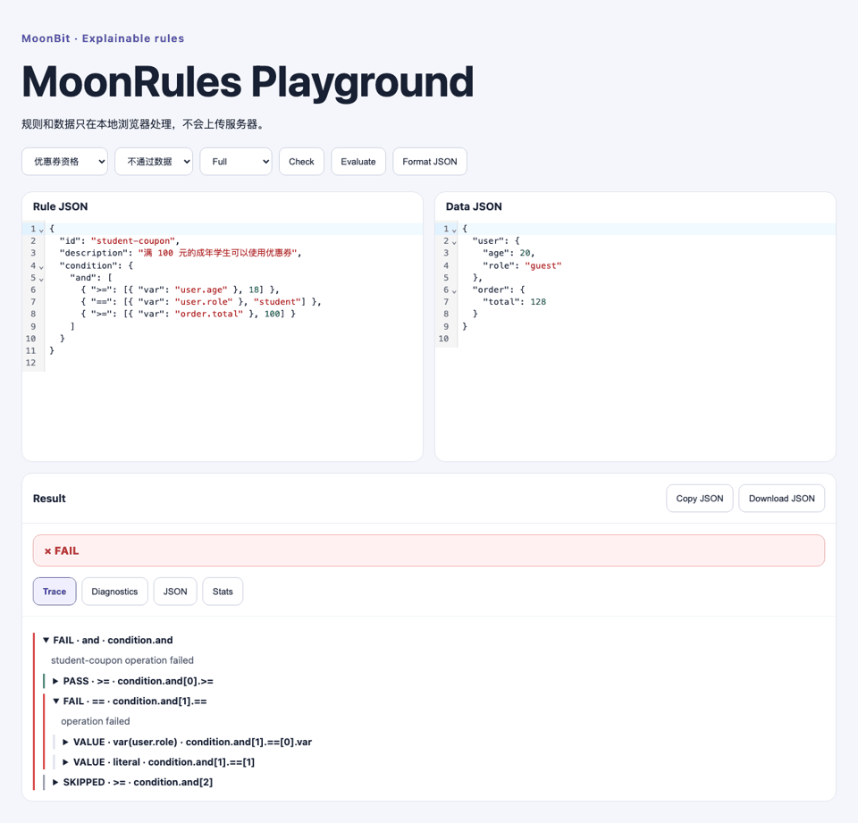

# MoonRules

[](https://github.com/z2823253773-p/moonrules/actions/workflows/ci.yml)
[](https://github.com/z2823253773-p/moonrules/releases/tag/v0.2.0)

**MoonBit 原生的可解释 JSON 业务规则引擎。** 当一条 API 准入、优惠券资格或配置策略判定为不通过时，MoonRules 不会只丢给你一个 `false`。它告诉你哪一步失败、变量取到了什么值、哪些分支因为短路被跳过。

> **在线试**：[Playground](https://z2823253773-p.github.io/moonrules/) · **装包**：[Mooncakes](https://mooncakes.io/docs/z2823253773-p/moonrules) `z2823253773-p/moonrules@0.2.0` · **看发布**：[GitHub Release v0.2.0](https://github.com/z2823253773-p/moonrules/releases/tag/v0.2.0) · [技术报告](docs/technical-report.md) · [一页申报书](output/pdf/moonrules-application.pdf)

业务规则通常用 JSON 表达，但执行结果常常只有 `true/false`。判定不通过时，开发者还要翻日志、补埋点、复现输入，才能定位是哪一步出错。JSON Schema 能校验字段结构，却无法表达“成年学生且订单满 100 元”这类跨字段业务条件，更解释不了失败路径。MoonRules 补的就是这一层：把规则解析成 MoonBit 中类型明确的规则树，执行前做诊断，执行后返回 `Pass` / `Fail` / `Indeterminate`，并保留每一步的变量取值、比较结果、错误和短路原因。

## 30 秒看懂

1. 打开 [Playground](https://z2823253773-p.github.io/moonrules/)。
2. 默认载入“优惠券资格”示例与 guest 数据，点击 **Evaluate**。
3. 结果是 `FAIL`。问题不在年龄或金额，而是 `user.role = "guest"` 不等于 `"student"`。
4. 切换到通过数据再执行，结果变 `PASS`，Trace 展示每个变量的实际值与比较结果。

所有 Playground 数据只在本地浏览器处理，不上传任何服务器。

## 为什么可信（一眼概览）

- **三项可验证设计**：可解释 Trace · 运行前诊断 · 确定性安全预算。
- **测试矩阵全绿**：71 native · 71 wasm-gc · 18 QuickCheck 性质测试 · 11 Playwright · 6 Vitest。
- **核心库零运行时依赖**：不碰文件、网络、环境变量或进程 API，可嵌入 CLI、Web Adapter 或后续服务入口。
- **公开可复现闭环**：GitHub 代码 · Mooncakes 包 · 公网 Playground · 可追踪 Release · 1-1000 节点基准。



## 为什么不是 JSON Schema

JSON Schema 适合回答“输入字段和类型是否合法”。MoonRules 回答“这份合法输入是否满足当前业务条件，以及为什么”。例如，订单结构可以完全合法，但用户仍可能因为身份不符或金额不足而不能使用优惠券。

## 可复制示例

规则：

```json
{
  "id": "student-coupon",
  "description": "满 100 元的成年学生可以使用优惠券",
  "condition": {
    "and": [
      { ">=": [{ "var": "user.age" }, 18] },
      { "==": [{ "var": "user.role" }, "student"] },
      { ">=": [{ "var": "order.total" }, 100] }
    ]
  }
}
```

数据（学生但角色为 guest，不通过）：

```json
{
  "user": { "age": 20, "role": "guest" },
  "order": { "total": 128 }
}
```

结果：

```text
FAIL student-coupon
├─ PASS user.age >= 18
│  ├─ VALUE var(user.age) = 20
│  └─ VALUE literal = 18
├─ FAIL user.role == "student"
│  ├─ VALUE var(user.role) = "guest"
│  └─ VALUE literal = "student"
└─ SKIPPED order.total >= 100
   └─ reason: and short-circuited
```

它不只返回 `Fail`，还告诉你哪个条件失败、实际值是什么、哪些分支被短路跳过。

## 立即安装

先安装 MoonBit 工具链：

```bash
curl -fsSL https://cli.moonbitlang.com/install/unix.sh | bash
```

从 mooncakes.io 安装：

```bash
moon add z2823253773-p/moonrules@0.2.0
```

克隆项目后验证：

```bash
moon check --deny-warn
moon test --target native
moon build --target native
```

## 库 API

公共入口：

- `parse(source)`：解析 JSON 字符串为 `RuleDocument`。
- `check(rule, budget?)`：返回 `Array[Diagnostic]`；空数组表示通过。
- `evaluate(rule, data, budget, trace_mode?)`：执行已解析规则，支持 `Full`、`Summary`、`Off` 三种 Trace 模式。
- `evaluate_json(rule_source, data_source, budget?, trace_mode?)`：完成解析、检查与执行。

结构化输出：

- `report_to_json(report)`：稳定字段的 JSON 报告。
- `diagnostics_to_json(diagnostics)`：诊断的 JSON 序列化。
- `render_report(report, budget)`：人类可读文本树。

完整契约见 [docs/API.md](docs/API.md)。

## CLI

v0.2 CLI 支持文件输入、stdin（`-`）、`--json` 输出、`--help` 和 `--version`：

```bash
# 检查规则
moon run --target native cmd/main check examples/coupon.rule.json
moon run --target native cmd/main check examples/coupon.rule.json --json

# 执行规则
moon run --target native cmd/main eval examples/coupon.rule.json --data examples/coupon.data.json
moon run --target native cmd/main eval examples/coupon.rule.json --data examples/coupon.data.json --json

# 从 stdin 读取
cat examples/coupon.rule.json | moon run --target native cmd/main check - --json
```

退出码：

- `0`：规则通过或检查无诊断。
- `1`：规则执行成功，业务判断为 `Fail`。
- `2`：参数、I/O、解析、检查或执行 `Indeterminate`。

## 可解释 Trace

每个 `var`、字面量和操作符都有独立 Trace 节点。节点记录规则路径、状态、已解析输入、结果、消息和子节点。

v0.2 有三种输出模式：

- **Full**：完整 Trace，包含所有变量、字面量、操作符节点。
- **Summary**：去掉普通取值叶节点，保留操作符、错误和短路节点。
- **Off**：仅返回根节点，保留 Decision 和 Stats。

三种模式先执行相同的完整求值，再做输出成形，因此 **Decision 和 Stats 始终一致**。

`and` 遇到 `false`、`or` 遇到 `true` 后，未执行的同级节点标记为 `SKIPPED`。预算超限时保留已有 Trace，并在截断点写入 `ERROR` 节点。

## 运行前检查

`check` 在没有运行时数据的情况下检查：

- 操作符是否存在、参数数量是否正确。
- V1 点号数据路径格式。
- 字面量类型是否明显错误。
- 规则深度和节点数。
- 调用方预算是否突破库上限。

诊断包含稳定的错误码（`E_ARITY`、`E_DATA_PATH`、`E_BUDGET_LIMIT` 等）、规则路径、说明和修改建议。

## 安全预算

| 预算 | 默认上限 |
|---|---:|
| 规则深度 | 64 |
| 规则节点 | 4096 |
| 执行步骤 | 10000 |
| Trace 节点 | 4096 |
| 文本预览字符 | 256 |

调用方可以调低限制，不能突破库默认上限。MoonRules 不使用墙钟超时，保持跨平台确定性。

## V1 操作符

- 数据：`var`、`literal`
- 逻辑：`and`、`or`、`not`
- 比较：`==`、`!=`、`>`、`>=`、`<`、`<=`
- 集合与字符串：`in`、`contains`、`starts_with`、`ends_with`

完整参数数量、类型和示例见 [docs/DSL.md](docs/DSL.md)。

## 示例

- 优惠券资格：`examples/coupon.*`
- API 请求准入：`examples/api-access.*`
- 会员资格：`examples/membership.*`

每个场景提供通过和不通过的数据，也可在 Playground 中直接切换。

## 核心创新

1. **可解释执行**：不只是 `true/false`，返回每一步变量取值、比较结果、错误和短路原因的结构化 Trace。
2. **运行前检查**：编译器风格的静态诊断，在执行前发现参数错误、非法路径和结构问题。
3. **确定性执行预算**：深度、节点数、步骤和 Trace 节点的硬限制，超限安全失败并保留部分 Trace。

## 测试与性能

- **测试矩阵全绿**：71 个 MoonBit 单元测试（native）+ 71 个（wasm-gc）+ 18 个 QuickCheck 性质测试 + 11 个 Playwright 浏览器测试 + 6 个 Vitest 单元测试。
- 可复现基准测试：1000 节点规则求值约 1 ms，Full Trace 渲染约 5 ms（Apple Silicon native release）。
- 详见 [docs/BENCHMARKS.md](docs/BENCHMARKS.md) 和 [docs/technical-report.md](docs/technical-report.md)。

## 架构

```text
JSON → Parser → Checker → Evaluator → Full Report
                                    → TraceMode 压缩 (Full/Summary/Off)
                                    → Renderer / CLI / Web Adapter → Playground
```

核心库不依赖文件系统、网络或环境 API。详细架构见 [docs/ARCHITECTURE.md](docs/ARCHITECTURE.md)。

## 限制与非目标

不提供完整 JSONLogic 兼容、数组下标数据路径、循环、用户函数、自定义操作符、网络访问、数据库、Web 服务或原生桌面 GUI。Playground 是唯一 GUI 例外，且仅在本地浏览器运行。

## 开发与测试

```bash
moon fmt --check
moon check --deny-warn
moon test --target native
moon test --target wasm-gc
moon build --target native
moon build --target wasm-gc
scripts/test_cli.sh
cd playground && npm test && npm run test:e2e
```

## 文档

- [API 参考](docs/API.md) · [DSL 语法](docs/DSL.md) · [错误与预算](docs/ERRORS.md)
- [架构说明](docs/ARCHITECTURE.md) · [技术报告](docs/technical-report.md) · [基准测试](docs/BENCHMARKS.md)
- [贡献指南](CONTRIBUTING.md) · [安全策略](SECURITY.md) · [路线图](ROADMAP.md) · [第三方声明](THIRD_PARTY_NOTICES.md)

## 许可证

Apache License 2.0。详见 [LICENSE](LICENSE)。
